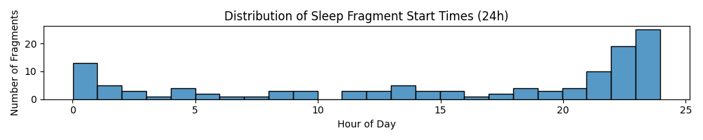
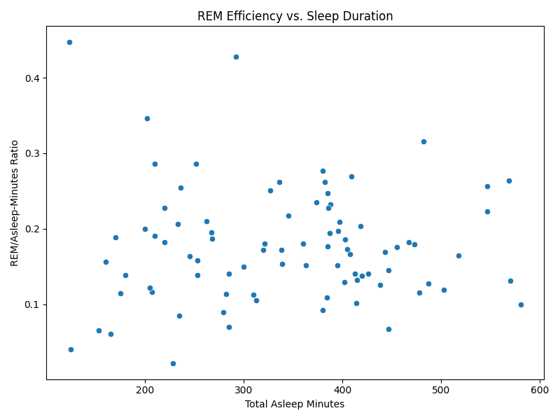
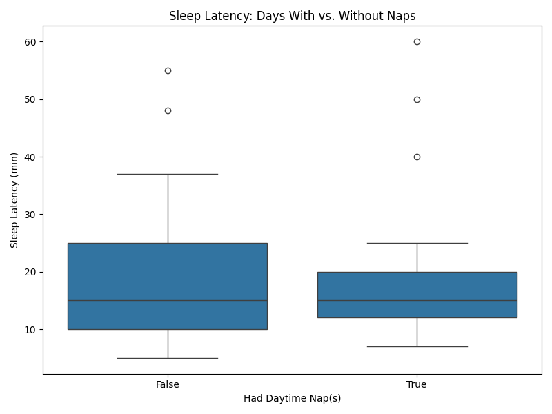
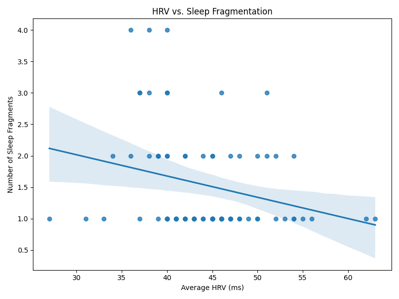
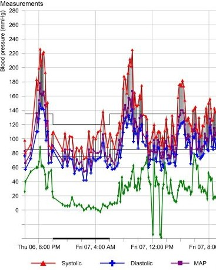

Title:  Coping with Fragmented Sleep

Subtitle:  Patient‑Driven Analysis of Wearable Sleep Data Using Generative AI:
A Case Study Demonstrating HRV-Sleep Fragmentation Dynamics

Authors:

Roy Rada, MD, PhD, Professor Emeritus

and

GenAI

Date: March 26, 2026

Corresponding Author: Roy Rada at rada@umbc.edu

**Abstract**

Objective: Help patients use Generative AI (GenAI) to analyze their
longitudinal wearable data? This paper presents a workflow for a patient
that illustrates what is broadly possible.

Method: The author

* purchased a health ring to facilitate data collection of his sleep
which is highly fragmented sleep due to frequent autonomic crises,
* collected sleep data over 3 months,
* used GenAI to build first a conceptual framework, then a
programmatic analysis of the longitudinal data set, and finally a
return to the framework as a novel Cognitive Behavioral Therapy
(CBT).

Results: Three data hypotheses were evaluated:

* was the proportion of REM sleep greater when sleep was less
fragmented,
* was sleep efficiency greater when sleep was less fragmented, and
* did high HRV correlate with high sleep fragmentation.

The hypothesis about REM sleep and sleep efficiency were false, but high
HRV did correlate with greater fragmentation.

Conclusion: The patient and GenAI generated a lifestyle program for the
patient called CBT-Balance which maintains homeostatic balance through
behavioral modification.

## Table of Contents

- [1 Introduction](#introduction)
- [2 Method of Data Analysis](#method-of-data-analysis)
  - [2.1 Data Cleaning](#data-cleaning)
  - [2.2 Hypotheses Testing](#hypotheses-testing)
- [3 Results of Data Analysis](#results-of-data-analysis)
  - [3.1 Hypothesis: Longer Sleep Better REM](#hypothesis-longer-sleep-better-rem)
  - [3.2 Hypothesis: Naps Affect Efficiency](#hypothesis-naps-affect-efficiency)
  - [3.3 Hypothesis: Low HRV Predicts Fragmented Sleep](#hypothesis-low-hrv-predicts-fragmented-sleep)
- [4 CBT-Balance](#cbt-balance)
  - [4.1 Context](#context)
  - [4.2 GenAI CBT-B 6-week Course](#genai-cbt-b-6-week-course)
  - [4.3 RR Prompt for QALY](#rr-prompt-for-qaly)
  - [4.4 GenAI Higher-Level Objectives](#genai-higher-level-objectives)
- [5 Discussion](#discussion)
- [6 Conclusion](#conclusion)
- [7 References](#references)

# Introduction

The growing market of consumer wearables and generative AI could help
patients who suffer from the gap between clinical capacity and patient
volume. The paper explores the opportunity for patient driven
computational analysis of health ring sleep data. The case of one
patient (call him RR or the author of this paper) illustrates how a
motivated patient with a health ring and Generative AI (GenAI) systems
can benefit health and lifestyle. This paper does not attempt a
systematic review of the relevant literature but in deference to the
author's academic roots he has added a few citations next.

A systematic review of GenAI to promote behavioral change in direct
interaction with patients concluded that GenAI has "demonstrated the
efficacy of health behavior change interventions among large and diverse
populations" (Aggarwal et al., 2023). Data from wearables help patients
self-manage disease. One study used a mobile Heart Rate Variability
(HRV) monitoring system and a relaxation training program on a
smartphone to test whether subjects could train themselves to reduce HRV
(Kizakevich et al., 2019). HRV has even been used to monitor how
programmers experience GenAI (Zhang et al., 2025) and serves as a
digital biomarker for both clinical care and daily performance.

Chronic sleep disorders are a major modifiable risk factor for chronic,
progressive diseases, such as neurodegenerative diseases. One study
shows a mechanism linking poor sleep to the accumulation of toxic
proteins in the brain and a bidirectional, self-perpetuating cycle,
where initial protein accumulation can, in turn, damage sleep-regulating
brain nuclei, further degrading sleep and accelerating pathology. This
framework highlights the importance of managing sleep
disorders.(Camberos-Barraza et al., 2025) HRV biofeedback training
targets autonomic nervous system regulation. HRV biofeedback training is
comparable to established interventions in improving psychological and
physiological outcomes (Wilson et al., 2025). For people with difficulty
falling asleep a popular intervention is a variant of Cognitive
Behavioral Training (CBT) called CBT-Insomnia (Öst et al., 2025). The RR
paper proposes a novel variant of CBT-I called CBT-Balance where the
"Balance" term refers to homeostatic balance in a patient with sleep
fragmentation.

# Method of Data Analysis

Polysomnography is the gold standard sleep study and occurs overnight in
a sleep laboratory. The patient is tracked by EEG, EKG, SpO2,
respirations, eye movement, and foot movement and focuses on efficiency
and continuity of sleep at night. RR has had a dozen polysomnography
tests over the past two decades and Positive Airway Pressure and
Mandibular Advancement Device treatments based on the results of
polysomnography. His problems now go beyond what that test or its
associated treatments offer.

RR bought a RingConn Gen 2 health ring (call it Ring) in December 2025.
Initial RR's objective was to raise the proportion of time asleep in
the REM stage and to increase sleep efficiency (measured as time asleep
over time in bed). With the help of GenAI, RR drafted an algorithm
called Cognitive Behavior Therapy Balanced as a variant of CBT-Insomnia
where the goal was to address fragmented sleep with a focus on
increasing sleep efficiency as a tactical effort underneath a broader
focus on maintaining homeostasis.

RR's sleep problem is related to severe homeostatic imbalance as
regards brain blood flow. He is at high risk for syncope or stroke and
collapses in bed often to re-establish adequate brain blood flow. These collapses typically lead
to naps that vary widely in duration from a few minutes to a few hours and occur
throughout the day and night.

The Ring exportable data requires the sleep episode to exceed two hours,
while direct access via the smartphone screen app shows far more data
including sleep durations of short durations. That led RR to this
dialogue with GenAI:

"As I further studied the data from my Ring this morning, I realized
that it omitted something crucial. It showed only sleeps of duration
greater than 2 hours which Ring requires to give the stages of sleep. By
manually visiting the days through the smartphone app, I added the
timing of the shorter naps (minus any sleep stages). Now I see much more
fragmented sleep. I suspect a focus on managing this fragmentation might
be more meaningful than a focus on sleep efficiency. In that regard, I
would like to further analyze the data in a systematic way to look for
patterns. For instance, I suspect that the longer sleeps have a higher
percentage of REM sleep but would like to confirm this. In addition, I
wonder how my daily HR or activity levels correspond to the
fragmentation. But analyzing the data is not straightforward due to the
formatting issues and complexity. Please suggest a data analysis
approach. I provide one CSV file that has 3 sets of data:

* Columns A-K on Rows 1 to 122 shows per row: start-time end-time
fall-asleep-time wake-up-time sleep-ratio asleep-mins awake
stage-REM stage-light and stage-deep (but the short duration naps
are empty in the columns other than start-time, end-time, and asleep
minutes).
* Columns L-N give date, steps, and calories for rows 2 to 80 -- one
row per day.
* Columns P-Y give date, average-HR, min-HR, max-HR, Ave-SpO2,
min-SpO2, max-SpO2, ave-HRV, min-HRV, and max-HRV for rows 2 to 80
-- one row per day.

GenAI responded with a 2-part plan for data cleaning and hypothesis
testing,

## Data Cleaning

The first step is to transform the "split" nature of your data into a
single, unified data structure.

* **The Sleep Log (Primary Table):** Create a table where every sleep
event (long or short) is a unique row.
* **Normalization:** For the short naps where stages are missing, the
program should treat these as "Unclassified" rather than "Zero."
This prevents them from dragging down your REM/Deep sleep averages
in the next step.
* **Day-Mapping:** Assign a "Sleep Day" ID to each nap. For example,
a nap at 2:00 PM on 1/6 and the main sleep starting at 11:30 PM on
1/6 should both be linked to the "1/6 Activity/HR Data."

The raw data present 3 problems that require special attention:

* The "Sleep Day" Boundary Rule: Since start-time for many main
sleeps occurs late at night (e.g., 11:30 PM on 1/6) and ends the
next morning (6:30 AM on 1/7), define a "Sleep Day" as a 24-hour
window starting at 12:00 PM (Noon). Any sleep event starting after
noon should be indexed to that day's activity and vitals, even if
the sleep ends the following calendar morning.
* Handling Missing Values: The short naps (Crisis Events) have empty
columns for sleep stages. When calculating REM/Deep sleep averages,
exclude (do not count as zero) any rows where those columns are
null. This prevents "short naps" from artificially lowering the
calculated sleep quality of the "main sleeps."
* HRV-Fragmentation Correlation Logic. Since HRV and Activity data are
one-row-per-day, but sleep events are multiple-rows-per-day, to
correlate HRV vs. Fragmentation, first aggregate the sleep log by
"Sleep Day" to count the number of fragments (rows) per day. Then,
perform a Left Join of this count onto the Vitals table using the
Date column.

## Hypotheses Testing

Since the goal is to address **fragmented sleep** and **homeostatic
imbalance**, focusing on these three specific correlations:

* **Correlation A: Sleep Duration vs. REM Density**

  * **Goal:** Confirm if longer sleeps provide better REM quality.
  * **Calculation:** For all sleeps >120 mins, calculate the
**REM/Asleep-Minutes** ratio. Plot this against the total
**Asleep-Minutes** to see if there is a "threshold" duration
where REM becomes more efficient.
* **Correlation B: The "Nap-Effect" on Main Sleep**

  * **Goal:** Determine if daytime "Crisis Event" naps (those
<120 mins) are helping or hurting the main nocturnal sleep
efficiency.
  * **Calculation:** Compare days with 0 naps vs. days with 1+ naps.
Look for changes in **Sleep Latency** (Start Time vs. Falling
Asleep Time) in the subsequent main sleep.
* **Correlation C: Activity/HRV as a "Crisis" Predictor**

  * **Goal:** See if daytime physiological load predicts a
fragmented night.
  * **Calculation:** Correlate **Daily Steps** and **Avg HRV** with
the number of sleep fragments that follow that night. For
example, does a low HRV day (<40 ms) consistently lead to more
"Crisis" naps the following day?

# Results of Data Analysis

The data analysis refuted the first two hypotheses but confirmed the
third one.

## Hypothesis: Longer Sleep Better REM

Claim: Longer sleep episodes (over 2 hours) have a higher proportion of
REM sleep, meaning REM becomes more efficient as sleep duration
increases. The program calculated the ratio of REM minutes to total
asleep minutes for all long sleep events and plotted this against sleep
duration.

Visual Result: If the scatter plot shows an upward trend (points rising
as sleep duration increases), this supports the hypothesis: longer
sleeps do provide more REM per minute. If the points are scattered with
no clear trend, or the ratio stays flat, the hypothesis is not
supported.

Interpretation: If supported, then prioritizing longer, uninterrupted
sleep may help maximize REM, which is important for cognitive and
emotional health. If not supported, then REM efficiency may not depend
on sleep length in your case, so focusing on sleep duration alone may
not improve REM.

Statistical: REM Efficiency vs. Sleep Duration

* Slope: 0.0000, Correlation (r): 0.004, p-value: 0.973
* Conclusion: No statistically significant relationship between sleep
duration and REM fraction.

## Hypothesis: Naps Affect Efficiency

Claim: Taking daytime naps (especially "crisis event" naps under 2
hours) changes how quickly you fall asleep at night.

What the analysis did: It compared the time it takes to fall asleep at
night (sleep latency) on days with naps versus days without naps. If the
boxplot shows higher sleep latency on nap days, then naps may make it
harder to fall asleep at night. If latency is lower or unchanged, then
naps may not negatively impact your main sleep.

Interpretation: If naps increase latency, then consider limiting naps or
timing them earlier in the day. If no effect, then naps may be a safe
coping strategy for crisis events without harming main sleep.

Statistical: Nap Effect on Sleep Latency

* Mean latency with nap: 19.0 min, Mean latency without nap: 17.8 min,
p-value: 0.710.
* Conclusion: No statistically significant effect of naps on sleep
latency.

## Hypothesis: Low HRV Predicts Fragmented Sleep

Claim: Days with lower heart rate variability (HRV) or higher activity
(steps) are followed by more fragmented sleep (more sleep events). The
program correlated daily average HRV and steps with the number of sleep
fragments that night.

Visual: If the trendline in the HRV vs. fragmentation plot slopes
downward, then low HRV predicts more fragmented sleep. If there's no
clear trend, then HRV and activity may not be strong predictors.

Interpretation: If supported, then monitoring HRV and activity could
help anticipate and manage sleep fragmentation. If not supported, then
other factors may be driving sleep fragmentation, and further
investigation is needed.

Statistical. HRV vs. Sleep Fragmentation:

* Slope: -0.0338, Correlation (r): -0.266, p-value: 0.019
* Conclusion: Lower HRV is associated with more fragmented sleep
(statistically significant).

Conclusion: Lower HRV is associated with more fragmented sleep
(statistically significant).

# CBT-Balance

This section is presented as a conversation between RR and GenAI: first
a RR prompt and then a GenAI response and repeat one more time.

## Context

RR prompt: We discussed the CBT-I (Cognitive Behavioral Training for
Insomnia) but agreed that my unique situation required something
different. Key aspects of my problem included fragmented sleep,
uncontrollable blood pressure, 100% blocked left internal carotid,
dysphagia, dysphonia, and severe COPD. The upshot is my need to be able
to 'nap' frequently to counter the tendence to collapse. So, I'd like
to sketch a
CBT-for-fragemented-sleep-due-to-overwhelming-homeostatic-balance-failure
(CBT-balance or CBT-B). 

Your pointers included a free 6-week course from
the Mayo Clinic on CBT-I. My impression is that CBT-I is not
standardized but represents an approach to retraining the body to fall
in line with circadian rhythms. If you know a standard CBT-I, then
please work off that. Otherwise, the Mayo one is fine. I want to modify
the 6-week course for my case and to be algorithmically rigorous.

My baseline daily routine that most maintains balance follows. To bed at
10 pm. Wake every 2 hours but finally after 7 hours at 5 a.m. leave the
bed. The next hours between 5 am and 10 pm will be filled with trying to
maintain nutrition, do my philanthropy work in virtual mode on the
computer, exercise, and nap. More precisely. I can only swallow pureed
food. Preparing it and consuming it takes me 2 hours. I can't eat in
social situations and only successfully when I sit in my office before
my computer screens with the bowl of puree by my side, and I sip once
every few minutes. After the 2 hours, I get dizzy from the sitting and
post-prandial effect and try to take a 20-minute walk or else go to bed.
If I manage to walk, then I go to bed on getting home. In the baseline
case, I nap for 20 minutes, wake, and resume the process of eat, walk,
nap till 6 pm. Then I stop consumption and work and take various breaks
till bedtime.

About twice a week events intervene such that my schedule is radically
changed. If I have a doctor's appointment and must spend 2-hours in
commuting each way and 2 hours with the appointment. I return home ready
to collapse and nap for two hours. That throws off my schedule.

I wear a Ring that monitors my sleep and activity. I can also collect
data from various devices for SpO2, heart rate, HRV, respiratory rate,
and BP. When I am in steady state collecting this data on the spot is
feasible, but when I have a crisis event, no active data collection is
possible.

My objective at the superficial level is to maintain the equanimity of
the steady state across crisis events. My deeper, long-range goal is to
maximize my remaining Quality Adjusted Life Years Remaining.

Can you give me a 6-week CBT algorithm to meet my desiderata that
includes precise objective measure.

## GenAI CBT-B 6-week Course

This algorithmic approach to **CBT-B (Balance)** replaces traditional
sleep restriction with **Sleep Compression**---a gentler, non-inferior
alternative designed for patients with complex medical comorbidities.

Standard CBT-I often uses abrupt **Sleep Restriction Therapy (SRT)** to
build homeostatic pressure, but for patients with dysautonomia or
syncope risks, this can cause dangerous autonomic stress. **Sleep
Compression Therapy (SCT)** instead reduces time-in-bed (TiB) gradually
to maintain Sleep Efficiency above 85%.

**Step 1: Baseline Audit and Loop Initialization (Week 1)**

* **Action**: Quantify current "Sleep Efficiency" (SE).
* **Formula**: SE = TST/TIB times 100.
* **Input**: Use Ring data to identify average TST (likely \~5-6 hours
given your 2-hour awakenings).
* **Objective**: Establish a baseline SE. Traditional CBT-I targets >85%.

**Step 2: Gradual Sleep Compression (Weeks 2-3)**

* **Action**: If SE < 85%, then reduce TiB in **20-minute
increments** per week rather than immediate restriction.
* **Logic**: If your current TiB is 7 hours (10 pm--5 am) but you only
sleep 5 hours, reduce TiB to 6h 40m in Week 2, then 6h 20m in Week 3.
* **Safety Trigger**: If SpO2 drops or BP variability increases beyond
your steady-state threshold, **freeze** compression.

**Step 3: Stimulus Control for Fragmented Sleep (Week 4)**

* **Action**: Re-associate the bed with sleep, not wakefulness.
* **Pseudo-code**:
* if is\_awake\_in\_bed > 20\_minutes: leave\_bed() and
perform\_low\_stim\_activity() *# e.g., sitting up, not walking if
dizzy.*
* if feel\_sleepy == True: return\_to\_bed()
* **Note**: For your dysphagia/COPD, "leaving the bed" can be
replaced by "sitting upright in a chair" to avoid syncope while
still breaking the bed-wake association.

**Step 4: Homeostatic Recovery - The "Crisis Event" Handler (Week 5)**

* **Action**: Formalize the "Crisis Event" (C-Event) protocol as an
interrupt in the algorithm.
* **Rule**: A C-Event (e.g., 2-hour collapse nap) is a **system
reset**, not a failure.
* **Logic**:

  * **If C-Event occurs**: Allow the 2-hour nap.
  * **Recovery**: Do *not* go to bed earlier than 10 pm that night.  Use \*\*Bright Light Therapy\*\* (high-lux screen or light box)
        > between 6 pm and 8 pm to suppress early melatonin and stay
        > awake until your scheduled window.

**Step 5: Biofeedback Integration and Maintenance (Week 6)**

* **Action**: Use your Ring and BP data as a "governor" for the
system.
* **Objective**: If SE > 85% for 7 days, increase TiB by 15 minutes.
If SE < 80%, maintain or slightly decrease TiB.
* **Long-range Goal**: Maximize Quality Adjusted Life Years (QALY) by
prioritizing **sleep consolidation** (fewer awakenings) over **total
sleep duration**.

**Precise Objective Measures**

For a numerate approach, track these four variables weekly:

| Measure | Metric | Target |
|---|---|---|
| Sleep Efficiency |  (TST / TiB) times 100    |    > 85%  |
| Consolidation Index   |  Longest continuous sleep block   |   > 3 hours  |
| Crisis Recovery Time  |  Days to return to 10 pm-5 am steady state |  < 2 days  |
| Autonomic Stability  |    Morning BP vs. Evening BP Delta |   Within 10 mmHg  |

The 6-week **CBT-B** algorithm utilizes **Sleep Compression** (reducing
time-in-bed by 20-minute weekly increments) to match physiological sleep
capacity while using **Bright Light Therapy** to manage "Crisis Event"
interrupts. The objective is to achieve a **Sleep Efficiency (SE) >
85%** and a **Consolidation Index > 3 hours**, prioritizing stable
homeostatic balance over raw sleep quantity.

## RR Prompt for QALY

People have a maze of homeostats (such as for BP, HR, and glucose level)
that interact with each other to maintain balance. In disease these
deteriorate and can start a negative feedback loop. Could you add a
layer of complexity and power that phrases the CBT-B in the theoretical
framework of maintaining homeostasis? You were clear about the immediate
tangibles of sleep efficiency but did not address the higher quality of
life. Set the top goal to be Quality Adjusted Life Years (QALY)
Remaining. Given that homeostasis includes not only physiological
parameters, such as BP, but also states of mind, could you add in this
higher layer something about states of mind linking to QALY Remaining?

## GenAI Higher-Level Objectives

Frame this as a **System Architecture** update for the "CBT-B" model
and move from a linear schedule to a **Dynamic Homeostatic Controller**
that prioritizes system stability (QALY) over sleep volume.

Life as a Multi-Variable Homeostat: In RR's case, sleep isn't an
isolated variable; it is the **Cooling System** for a high-friction
engine ( BP, COPD, and Dysphagia). When a **Crisis Event (C-Event)**
occurs, it acts as a "Thermal Spike" that threatens to trip the
system's safety breakers (syncope/collapse).

**1. The Crisis-Event Handler Algorithm (The "Soft-Reboot")**

Instead of viewing a 2-hour post-appointment collapse as a failure of
the schedule, we define it as a **Corrective Homeostatic Shift**.

def handle\_crisis\_event(current\_vitals, fatigue\_level):

*# STEP 1: Urgent Load Shedding*

if fatigue\_level == "CRITICAL" or current\_vitals.BP < threshold:

trigger\_nap(duration=120, mode="Recovery")

*# STEP 2: The Re-Entry Lock (The "Delta" Management)*

*# The goal is to prevent the nap from shifting the Circadian Phase*

wait\_until(bedtime\_standard)

if sleep\_drive < threshold\_at\_10pm:

apply\_stimulus("Bright\_Light\_Therapy", duration=30) *# Suppress early
melatonin*

execute\_respiratory\_stack("Pursed\_Lip\_Breathing") *# Stabilize
COPD/CO2 levels*

**2. Scaling to QALY: The "State of Mind" Homeostat**

To address **QALY**, recognize that "Quality" is a subjective weight
applied to physiological data. If RR is technically "balanced" but
unable to perform his philanthropy or enjoy his virtual work, the QALY
multiplier drops toward zero.

* **The QALY Equation in CBT-B**:
* QALY = sum (Physiological\_Stability times Cognitive\_Engagement)
* **The Logic**: If restricting sleep to 5 hours (for "efficiency")
makes RR too foggy to do his computer work, it is a **net QALY
loss**, even if the sleep algorithm looks "perfect."

**The Higher-Layer Objective: "Equanimity as a Buffer"**

In a deteriorating system, the "Homeostatic Range" narrows. A healthy
20-year-old has a wide BP buffer; RR's is thin.

* **The Goal**: Use the 6-week CBT-B to **widen the buffer** by
reducing "System Noise."
* **Measure**: Instead of just tracking Sleep Efficiency, track
**Recovery Latency**---how many hours does it take for HRV and BP to
return to baseline after a C-Event?

**The shorter the Recovery Latency, the higher the QALY.**

System Resets: The **Crisis-Event Handler** treats collapse-naps as
essential "System Resets" rather than schedule errors, using **Bright
Light** and **Respiratory Stacking** to prevent these resets from
drifting your circadian anchor. Focusing on **Recovery Latency** (the
speed at which vitals return to baseline after a stressor) optimizes for
**QALY**, ensuring the physiological "buffer" remains wide enough to
support RR's work. By reclassifying a crisis as a **Corrective Shift**,
the algorithm moves from a "fail-stop" model to a "fault-tolerant"
one.

# Discussion

This patient plus GenAI experience has allowed the patient to replace
"napping guilt" with a data-backed **Homeostatic Strategy**. The fact
that RR's sleep latency isn't affected by naps (the p = 0.710 finding)
is his "green light." In standard CBT-I, napping is often forbidden
because it "steals" the hunger for sleep at night. RR's data shows
that his body doesn't work that way--- his naps are **restorative
"top-offs"** for his brain's blood flow, not a replacement for
nocturnal drive.

HRV can serve as the body's "resilience meter" where

* **High HRV** means the nervous system is flexible and "ready for
anything."
* **Low HRV** (RR's 27--31 ms range) means his system is under stress
or in "fight or flight mode," which explains why his sleep then
fragments as his brain tries to protect itself.

Knowing that a low-HRV morning predicts a fragmented night allows him to
**anticipate** the dizziness rather than being surprised by it. This
moves him from a reactive "Crisis" mode to a **predictive**
"Management" mode.

HRV may be seen as a "Crisis Event" Predictor. Standard CBT-I usually
ignores daily physical stress, but RR's data shows that **low HRV is a
leading indicator**. If his HRV is low during the day, his nervous
system is "brittle." On low HRV days, he should be **proactive** with
his Crisis Event Handler. Instead of waiting until he is severely dizzy
to nap, he should expect that his sleep will be fragmented and plan rest
periods to prevent syncope.

One of the hardest parts of CBT-I is the guilt or fear that napping
ruins nighttime sleep. RR's second finding (p = 0.710) shows that naps
do not make it harder for him to fall asleep. This "de-risks" napping
for him. Napping is a safe tactical tool for maintaining blood flow
homeostasis because it doesn't appear to steal his "sleep drive"
(homeostatic pressure) for the night.

Further data analysis would probe more deeply the variables, such as
intra-day HRV values and proximal naps or specific HRV 'danger zone'
number (the threshold where fragmentation usually starts) to help define
the daily "Crisis" trigger. Sleep fragmentation may be influenced by
factors not captured in current data (such as medication, stress, or
diet). RR could consider tracking additional variables and using a sleep
diary. He might review the summary statistics (means, medians) for each
variable to get a sense of his typical sleep and health.

# Conclusion

This paper does not forward a clinical claim of a validated clinical
study. In medical journal parlance the paper is a "n of 1" case study
with the patient and author as the same person -- subjective and prone
to bias. However, the author has also been transparent in providing his
data and programs in a public GitHub repository (see 
https://GitHub.com/royrada/SleepAnalysis) and arguing that his experience could benefit
other patients. Other patients have access to GenAI, have medical
problems, and are tracking their own health parameters. They can use the
workflow illustrated in this paper to help themselves.

The insights offered here are physiologically plausible. Anyone can
repeat the experiment with RR's data or apply the program to their own
data. This workflow directly empowers patients. Appreciating
opportunities can also empower clinicians. By building on patient
energies to focus on an individual's case allows 'personalized
medicine'. In some circles, personalized medicine refers to health care
that uses a patient's' molecular fingerprint, for instance, the
patient's genome, to inform the tailoring of diagnosis or treatment.
Personalization may also consider the patient's life history and style.
Mobile devices and intelligent computer assistants offer
personalization.

This paper has many limitations beyond the limitations of a solo
subject. The Ring is not transparent about its algorithms. Manufacturers
of health rings and watches rely heavily on photoplethysmography (PPG).
PPG is susceptible to noise that masks cardiovascular information and
reduces accuracy of the measurement. Clinicians work to standards and
regulations, and consumer wearables have not become part of their
professional culture. The patient needs the healthcare system and must
be careful in approaching clinicians about consumable wearables or
GenAI.

# References

Aggarwal, A., Tam, C. C., Wu, D., Li, X., \& Qiao, S. (2023). Artificial
Intelligence-Based Chatbots for Promoting Health Behavioral Changes:
Systematic Review. *J Med Internet Res*, *25*, e40789.
https://doi.org/10.2196/40789

Camberos-Barraza, J., Alemán-Villa, K. M., \& Alberto, K. (2025). The
mind awake at night: Glymphatic dysfunction as a mechanistic bridge
linking multifactorial sleep disturbances to neurodegeneration. *Journal
of Clinical and Basic Psychosomatics*, 025390076.

Kizakevich, P. N., Eckhoff, R. P., Lewis, G. F., Davila, M. I., Hourani,
L. L., Watkins, R., Weimer, B., Wills, T., Morgan, J. K., \& Morgan, T.
(2019). Biofeedback-assisted resilience training for traumatic and
operational stress: preliminary analysis of a self-delivered digital
health methodology. *JMIR mHealth and uHealth*, *7*(9), e12590.

Öst, L.-G., Brattmyr, M., Enebrink, P., Finnes, A., Ghaderi, A.,
Hansdottir, I., Havnen, A., Njardvik, U., Salomonsson, S., \& Wergeland,
G. J. (2025). Cognitive behavioral therapy for adult insomnia disorder
in routine clinical care: a systematic review and meta-analysis.
*Cognitive Behaviour Therapy*, 1-19.

Wilson, S., Maciu, A.-R.-L., \& Ashcroft, K. (2025). Feasibility and
Effectiveness of Portable/Remote Heart Rate Variability (HRV)
Biofeedback Training in Treating Stress and Mental Health Difficulties:
A Systematic Review. *Applied Psychophysiology and Biofeedback*, 1-24.

Zhang, H., Wang, S., \& Li, Z. (2025). The neurophysiological paradox of
AI-induced frustration: A multimodal study of heart rate variability,
affective responses, and creative output. *Brain Sciences*, *15*(6),
565.

